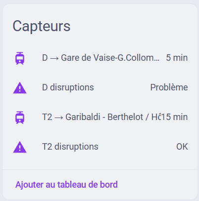
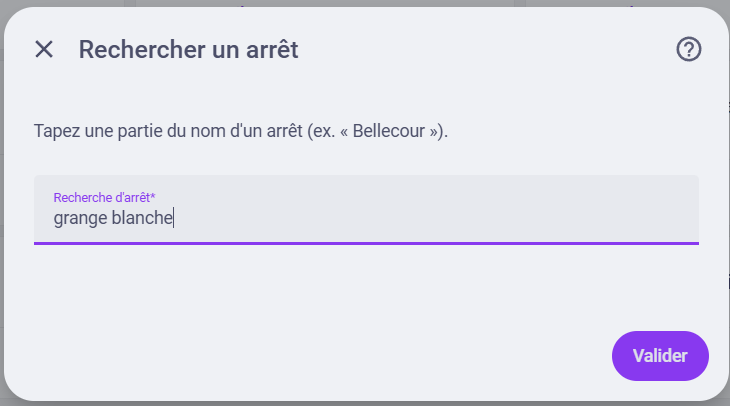
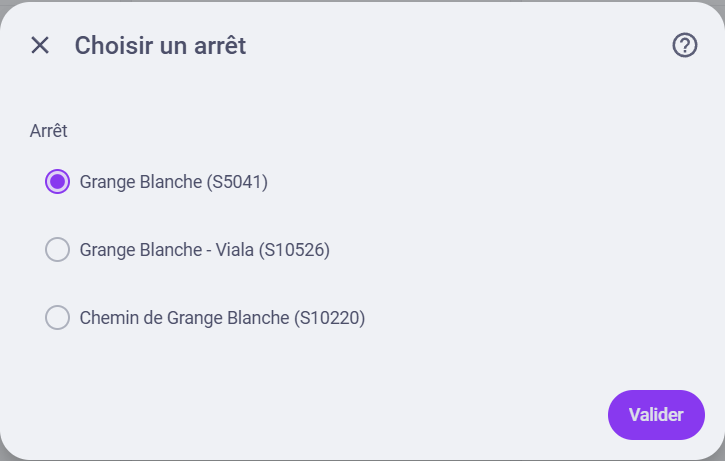
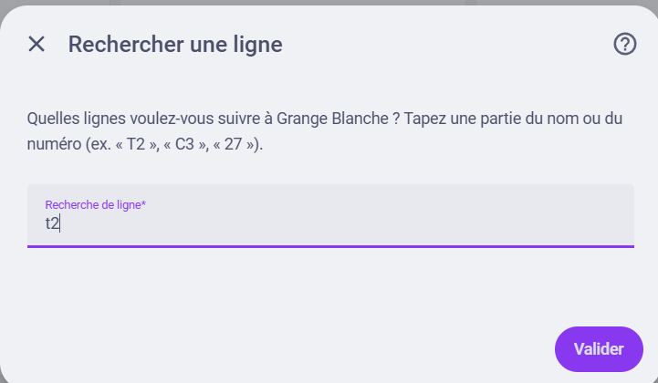
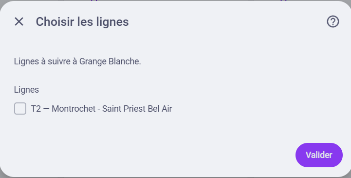
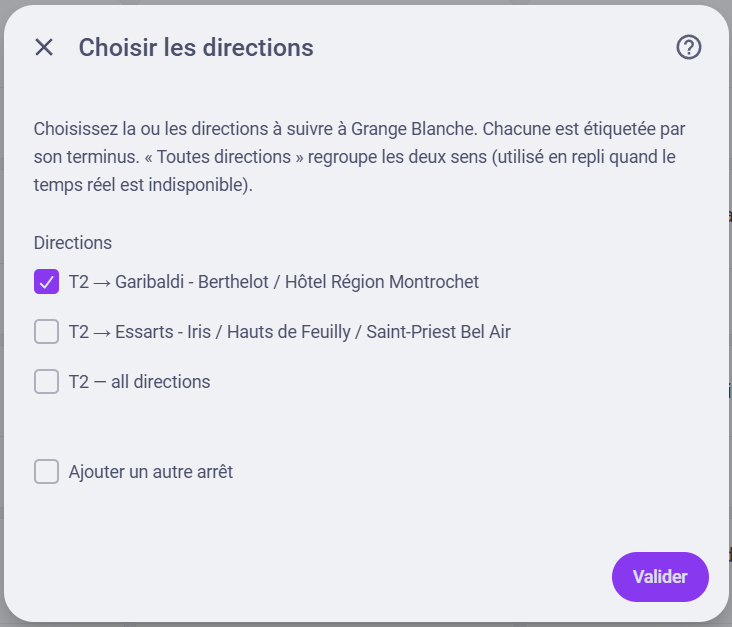

# TCL Lyon — Home Assistant Integration

Custom integration for the **TCL** (Transports en Commun Lyonnais) public transport network in Lyon, France.

Trigger Home Assistant automations N minutes before your tram/bus arrives at a stop, get notified when your line is disrupted, and surface other useful info from the public data.grandlyon.com API.

> **Status:** Working — UI setup with stop / line / direction search, per-direction
> "next passage" sensors, per-line disruption binary sensors, and a Configure flow
> to add or remove them later.



## Requirements

- Home Assistant **2025.2.0** or later (Python 3.13).
- A **GrandLyon Connect** account (free): https://moncompte.grandlyon.com/login/
- A **data password** for data.grandlyon.com, set via the forgot-password flow:
  1. Log out of data.grandlyon.com.
  2. Go to https://data.grandlyon.com/portail/fr/mot-de-passe-oublie
  3. Use it to **define** your data password — this works for first-time setup even if you haven't actually forgotten anything. This password is distinct from your SSO password.

> ⚠️ The data password is **not** the same as your GrandLyon Connect SSO password. This is the most common cause of 401 errors during setup.

## Installation

### Via HACS (recommended once published)

1. HACS → Integrations → ⋮ → Custom repositories → add this repo URL as an **Integration**.
2. Install "TCL Lyon".
3. Restart Home Assistant.
4. Settings → Devices & Services → Add Integration → "TCL Lyon".

### Manual

Copy `custom_components/tcl_lyon/` into your HA config's `custom_components/` directory. Restart HA.

## Configuration

All configuration is done through the UI — no YAML. After adding the integration:

1. **Credentials** — your data.grandlyon.com login is validated, then the GTFS
   catalogue downloads.
2. **Find a stop** — type part of a stop name and pick it from the matches.

   
   

3. **Choose lines** — search and multi-select the lines you want to follow there.

   
   

4. **Choose directions** — each is labelled by its terminus (e.g. "T2 → Garibaldi"),
   with an "All directions" option that combines both.

   

5. **Add another stop**, or finish.

To change your stops, lines, or directions later, use the integration's
**Configure** button (Settings → Devices & Services → TCL Lyon → Configure) to add
or remove sensors — no need to re-enter credentials. If your data password stops
working, Home Assistant prompts you to re-enter it without losing your stops.

## Entities

One sensor is created per (stop, line, direction) you follow:

- **`sensor.<line>_<terminus>_<stop>`** (e.g. `sensor.t1_la_doua_bellecour`) — whole
  minutes until the next passage of that line **in that direction** at that stop.
  `unavailable` while the API is down; empty when no passage is currently known.
  - Attribute `next_departures`: upcoming passes with aimed/expected times, a
    realtime flag, a cancellation flag, the direction/destination, and minutes-to-go.

> Picking "All directions" instead of a terminus gives a single sensor that reports
> whichever direction comes next (named `sensor.<line>_<stop>`).

One binary sensor is created per distinct line you follow (deduplicated across
stops):

- **`binary_sensor.<line>_disruptions`** (`device_class: problem`) — `on` while the
  line has at least one active disruption in the public `situation-exchange` feed,
  `off` when clear, `unavailable` while that feed is down.
  - Attribute `summary`: a human-readable digest (one line per active disruption,
    the French text TCL publishes) — drop it straight into a notification with no
    templating.
  - Attribute `disruption_count`: number of active disruptions on the line.
  - Attribute `disruptions`: the full list, each with `situation_number`,
    `description`, `keywords`, `report_type`, and `validity_period`.

  See [a real sensor's attributes](images/7-disruption-example.yaml) for a full example.

## Automation example

Notify 15 minutes before the next T1 tram at Bellecour:

```yaml
automation:
  - alias: "Bellecour T1 — leave soon"
    trigger:
      - platform: numeric_state
        entity_id: sensor.t1_la_doua_bellecour
        below: 16
        above: 14
    action:
      - service: notify.mobile_app_my_phone
        data:
          message: "T1 in ~15 min — head out!"
```

Notify when your line becomes disrupted, using the ready-made `summary`:

```yaml
automation:
  - alias: "T1 — disruption alert"
    trigger:
      - platform: state
        entity_id: binary_sensor.t1_disruptions
        to: "on"
    action:
      - service: notify.mobile_app_my_phone
        data:
          message: "T1 disrupted: {{ state_attr('binary_sensor.t1_disruptions', 'summary') }}"
```

## Development

Contributions are welcome. Install the dev dependencies and run the checks:

```bash
pip install -r requirements-dev.txt
ruff check .
pytest
```

## License

MIT. See [LICENSE](LICENSE).
